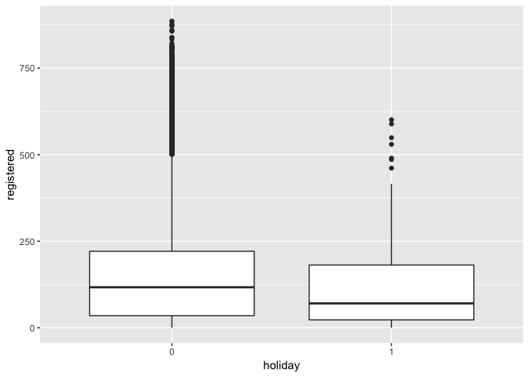

Bike Sharing
================
Nériton Tolentino
June 8, 2019

Bike Sharing Exploration by Nériton Tolentino
=============================================

Univariate Plots Section
========================

    ## [1] "The HOUR dataset has 17379 rows and 17 columns"

    ## 'data.frame':    17379 obs. of  17 variables:
    ##  $ instant   : int  1 2 3 4 5 6 7 8 9 10 ...
    ##  $ dteday    : Factor w/ 731 levels "2011-01-01","2011-01-02",..: 1 1 1 1 1 1 1 1 1 1 ...
    ##  $ season    : int  1 1 1 1 1 1 1 1 1 1 ...
    ##  $ yr        : int  0 0 0 0 0 0 0 0 0 0 ...
    ##  $ mnth      : int  1 1 1 1 1 1 1 1 1 1 ...
    ##  $ hr        : int  0 1 2 3 4 5 6 7 8 9 ...
    ##  $ holiday   : int  0 0 0 0 0 0 0 0 0 0 ...
    ##  $ weekday   : int  6 6 6 6 6 6 6 6 6 6 ...
    ##  $ workingday: int  0 0 0 0 0 0 0 0 0 0 ...
    ##  $ weathersit: int  1 1 1 1 1 2 1 1 1 1 ...
    ##  $ temp      : num  0.24 0.22 0.22 0.24 0.24 0.24 0.22 0.2 0.24 0.32 ...
    ##  $ atemp     : num  0.288 0.273 0.273 0.288 0.288 ...
    ##  $ hum       : num  0.81 0.8 0.8 0.75 0.75 0.75 0.8 0.86 0.75 0.76 ...
    ##  $ windspeed : num  0 0 0 0 0 0.0896 0 0 0 0 ...
    ##  $ casual    : int  3 8 5 3 0 0 2 1 1 8 ...
    ##  $ registered: int  13 32 27 10 1 1 0 2 7 6 ...
    ##  $ cnt       : int  16 40 32 13 1 1 2 3 8 14 ...

    ##     instant             dteday          season            yr        
    ##  Min.   :    1   2011-01-01:   24   Min.   :1.000   Min.   :0.0000  
    ##  1st Qu.: 4346   2011-01-08:   24   1st Qu.:2.000   1st Qu.:0.0000  
    ##  Median : 8690   2011-01-09:   24   Median :3.000   Median :1.0000  
    ##  Mean   : 8690   2011-01-10:   24   Mean   :2.502   Mean   :0.5026  
    ##  3rd Qu.:13034   2011-01-13:   24   3rd Qu.:3.000   3rd Qu.:1.0000  
    ##  Max.   :17379   2011-01-15:   24   Max.   :4.000   Max.   :1.0000  
    ##                  (Other)   :17235                                   
    ##       mnth              hr           holiday           weekday     
    ##  Min.   : 1.000   Min.   : 0.00   Min.   :0.00000   Min.   :0.000  
    ##  1st Qu.: 4.000   1st Qu.: 6.00   1st Qu.:0.00000   1st Qu.:1.000  
    ##  Median : 7.000   Median :12.00   Median :0.00000   Median :3.000  
    ##  Mean   : 6.538   Mean   :11.55   Mean   :0.02877   Mean   :3.004  
    ##  3rd Qu.:10.000   3rd Qu.:18.00   3rd Qu.:0.00000   3rd Qu.:5.000  
    ##  Max.   :12.000   Max.   :23.00   Max.   :1.00000   Max.   :6.000  
    ##                                                                    
    ##    workingday       weathersit         temp           atemp       
    ##  Min.   :0.0000   Min.   :1.000   Min.   :0.020   Min.   :0.0000  
    ##  1st Qu.:0.0000   1st Qu.:1.000   1st Qu.:0.340   1st Qu.:0.3333  
    ##  Median :1.0000   Median :1.000   Median :0.500   Median :0.4848  
    ##  Mean   :0.6827   Mean   :1.425   Mean   :0.497   Mean   :0.4758  
    ##  3rd Qu.:1.0000   3rd Qu.:2.000   3rd Qu.:0.660   3rd Qu.:0.6212  
    ##  Max.   :1.0000   Max.   :4.000   Max.   :1.000   Max.   :1.0000  
    ##                                                                   
    ##       hum           windspeed          casual         registered   
    ##  Min.   :0.0000   Min.   :0.0000   Min.   :  0.00   Min.   :  0.0  
    ##  1st Qu.:0.4800   1st Qu.:0.1045   1st Qu.:  4.00   1st Qu.: 34.0  
    ##  Median :0.6300   Median :0.1940   Median : 17.00   Median :115.0  
    ##  Mean   :0.6272   Mean   :0.1901   Mean   : 35.68   Mean   :153.8  
    ##  3rd Qu.:0.7800   3rd Qu.:0.2537   3rd Qu.: 48.00   3rd Qu.:220.0  
    ##  Max.   :1.0000   Max.   :0.8507   Max.   :367.00   Max.   :886.0  
    ##                                                                    
    ##       cnt       
    ##  Min.   :  1.0  
    ##  1st Qu.: 40.0  
    ##  Median :142.0  
    ##  Mean   :189.5  
    ##  3rd Qu.:281.0  
    ##  Max.   :977.0  
    ## 

The "temp" variable histogram do not tell us anything special except that renting is more common between 0 and 30 degrees. We will explore this data more deeply with other variables later.

It looks like there is a multimodal distribution in this variable, with atemp peaking around 5, 12, 18 and 22 degrees.

The histogram of "hum" varible seems a little left skewed.

Here we note a concentration of 0 values and then a right skewd distribution. We do not know if those 0 values are missing filled with 0 or the windspeed was really 0 at that moment.

Most of the days have good weather situation and there was only 3 days when the weather was very bad. We also note more records in the Summer and slightly more records on the weekends compared to the other days.

Univariate Analysis
===================

What is the structure of your dataset?
--------------------------------------

This dataset contains the hourly count of rental bikes between years 2011 and 2012 in a bikeshare system with the corresponding weather and seasonal information. We have a total of 17,379 hour counts with 14 features (season, year, month, hour, holiday, weekday, workingday, weather situation, temperature, feeling temperature, humidity, windspeed, count of casual users and count of registered users).

Some observations:

-   weathersit has values of "Good", "Normal", "Bad" and "Very Bad";
-   seaon has values of "Spring", "Summer", "Fall" and "Winter".

What is/are the main feature(s) of interest in your dataset?
------------------------------------------------------------

I suspect the main features in the dataset are related to the weather situation of the day, like temperature and humidity. The hour of the day and the day of the week are other variables that may have a strong influence in demand, since people would like to rent a bike to go to work/school.

What other features in the dataset do you think will help support your investigation into your feature(s) of interest?
----------------------------------------------------------------------------------------------------------------------

I suppose windspeed, season and month may also contribute to rental demand. If a certain day is a holiday or not might be important as well.

### Did you create any new variables from existing variables in the dataset?

No, I did not.

### Of the features you investigated, were there any unusual distributions? Did you perform any operations on the data to tidy, adjust, or change the form of the data? If so, why did you do this?

No, there were not.

Bivariate Plots Section
=======================

Here in the plot matrix we can clearly see that temperature and feeling temperature are highly correlated 0.99 (as we obviously expected!). There is a moderate correlation between temperature and casual users as well. And more, this correlation is stronger than the one between temperature and registered users. This may be because registered users rent bikes to go to work/school and they are less sensible to temperature since they would go to their destination even though.

    ## $`2011`
    ##    Min. 1st Qu.  Median    Mean 3rd Qu.    Max. 
    ##     1.0    31.0   109.0   143.8   211.0   651.0 
    ## 
    ## $`2012`
    ##    Min. 1st Qu.  Median    Mean 3rd Qu.    Max. 
    ##     1.0    53.0   191.0   234.7   347.0   977.0

It looks like the demand is increasing from 2011 to 2012.

From the boxplot of cnt, casual and registered by hour of the day we can infer that the demand for registered users has two peaks: one between 7am and 8am and other between 5pm and 6pm. On the other side, casual user's demand is smoother and more concentrated between 10am and 7pm.

    ## $Winter
    ##    Min. 1st Qu.  Median    Mean 3rd Qu.    Max. 
    ##     1.0    23.0    76.0   111.1   158.0   801.0 
    ## 
    ## $Spring
    ##    Min. 1st Qu.  Median    Mean 3rd Qu.    Max. 
    ##     1.0    46.0   165.0   208.3   311.0   957.0 
    ## 
    ## $Summer
    ##    Min. 1st Qu.  Median    Mean 3rd Qu.    Max. 
    ##       1      68     199     236     345     977 
    ## 
    ## $Fall
    ##    Min. 1st Qu.  Median    Mean 3rd Qu.    Max. 
    ##     1.0    46.0   155.5   198.9   295.0   967.0

From the boxplot above we can see the demand for renting bikes is concentrated between the months of Spring and Summer. Besides that, the demand for days with Bad and Very Bad weather situation is considerably lower than Good and Normal days.

Here again, we can see that temperature is an important feature because when the demand is stronger (Spring and Summer / Good and Normal days) the temperature is higher.

I can not see a strong trend in humidity between seasons/months, although we note that the months with higher demand are not the ones with high/lower humidity. Also, the Bad and Very Bad days have high humidity indicators.

From the boxplots above I cannot see a clear trend in windspeed between season/month.

Here, I can see a higher demand for casual users on holidays and the opposite for registered users.

When we look to weekdays we see that the demand of casual users is clearly higher on weekends while registered users rent more bikes on working days

Bivariate Analysis
==================

### Talk about some of the relationships you observed in this part of the investigation. How did the feature(s) of interest vary with other features in the dataset?

I noticed that weather situation is closely related with temperature and humidity. As one also might expect, the temperature and humidity are very correlated with season and month of the year. Hence, there is a trend in demand for bike renting related to this variables: as temperature increses, the demand goes up too.

When we look to hour of day and day of week, there is a very different renting behaviour between casual and registered users. Casual users rent more bikes in the middle of the day and on holidays, whereas registered users rent more bikes on working days and in rush hours. This is important to know because we could offer different products to different kind of users.

### Did you observe any interesting relationships between the other features (not the main feature(s) of interest)?

Yes, we noticed there is a relationship between renting demand and season/month, but this might be influenced by temperature that varies among the seasons of the year.

Another important observation to make is that renting demand changes with holidays. And more, the change is different for casual and registered users.

### What was the strongest relationship you found?

The demand is strongly correlated with the hour of the day. Also, the month and season have both high influence on demand. This may be because of temperature and humidity changes during the year and this is caught mostly by month and season variables. Finally, if the day is a holiday or a weekend also changes the way people rent bikes.

Multivariate Plots Section
==========================

Here, we can clearly see there is a strong seasonality during the hours of a day, with demand peaks at 9 AM and 6 to 7 PM on weekdays. On weekends, the demand for bike renting is concentrated between 11 AM and 7 PM, but it is not as high as on weekdays. This tells us again that most of our clients may be renting a bike to go to work/school.

This lineplot of mean count by month and weekday is interesting. It shows us once again the demand is weaker during the colder seasons (winter and fall). When it comes to weekdays, the lines have similar behaviors along the year, but when we look to weekends, there are demand peaks in June and September (surprisingly overtaking the demand on weekdays!) and a drop of it in July and August. This is counterintuitive for me, because I was expecting more demand on weekends in hot months.

This lineplot of mean count by hour and season aggregates two of the most important variables that affects bike renting demand. Here we can see the variation in demand during the hours of a day is present in all seasons. Besides that, cold weather drastically determines demand.

With this plot of mean count by hour of the day and type of user is easier to see the different renting behavior between casual and registered users. While registered users rent bikes like they would be going to work/school (bacause of the peaks on demand), casual users rent like they were tourists.

This barplot tells us one more information about differences between casual and registered users: on weekends, there are more casual users using the service compared to weekdays. This might be local users that don't use the service to go to work/school and we could convert them in registered users, since they may have a bike station near home.

This last plot might help us identify the relationship between season and bike renting demand. It shows us the count of days by temperature and weather situation among seasons. So, in the summer, when the quantity of days with high temperature and good weather is greater than in others seasons, we have the highest demand for renting.

Multivariate Analysis
=====================

### Talk about some of the relationships you observed in this part of the investigation. Were there features that strengthened each other in terms of looking at your feature(s) of interest?

The hour of the day is a very important feature for bike renting demand. But this feature combined with weekday, type of user and season is even stronger. This is evidencing the different kinds of renting behavior we have in our business case due to weather conditions and why people is renting our bikes for.

### Were there any interesting or surprising interactions between features?

The demand variation pattern along the day holds across the four seasons, even with a great drop on demand level in the winter. Also, there is a drop on demand for weekends during hot months, which is counterintuitive for me.

------------------------------------------------------------------------

Final Plots and Summary
=======================

### Plot One

### Description One

The bike renting demand seems to have two peaks along the day, perhaps because people habits (going to work/school).

### Plot Two

### Description Two

The day of the week is also very important to identify the demand because of why users rent bikes (to go to work/school or leisure).

### Plot Three

### Description Three

The lineplot shows us the variation pattern along the day and differences in demand between seasons, mostly because temperature and weather situation shaping the rent behavior.

------------------------------------------------------------------------

Reflection
==========

This dataset contains the hourly count of rental bikes between years 2011 and 2012 in Capital bikeshare system with the corresponding weather and seasonal information.

I started plotting some histograms of numeric variables as temperature, feeling temperature, humidity and windspeed. Those first plots were not too conclusive, but gave me some clues like the multimodal temperature distribution that I investigated further later.

In the bivariate plots section the variation on demand along the day/month became clearer and so did the variation due to temperature and weather situation. The plot matrix helped me understand the correlation between variables and then explore deeper those relationships. The type of user (casual/registered) is also a very interesting variable to look at. Demand behavior is modeled by the reason a user is renting a bike for: to go to work/school or for leisure.

As one would expect, there is a potential to increase the baseline of registered users, since we found out with the barplot in the multivariate plot section that there are users renting bikes only on weekends.

For future work I would try to create a regression model to predict the bike renting demand using climate and datetime information provided by the dataset.
